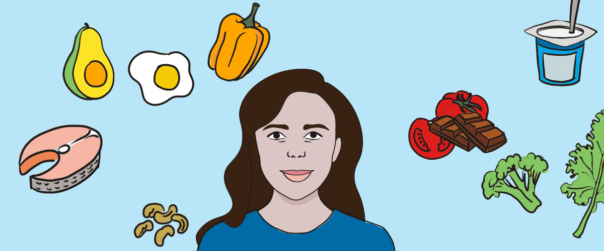
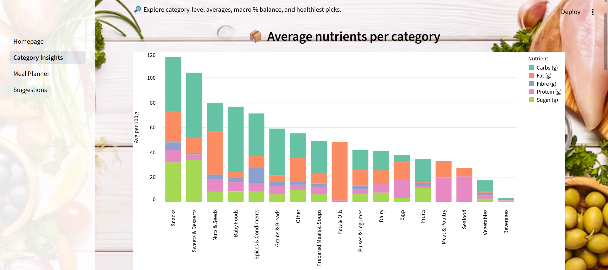
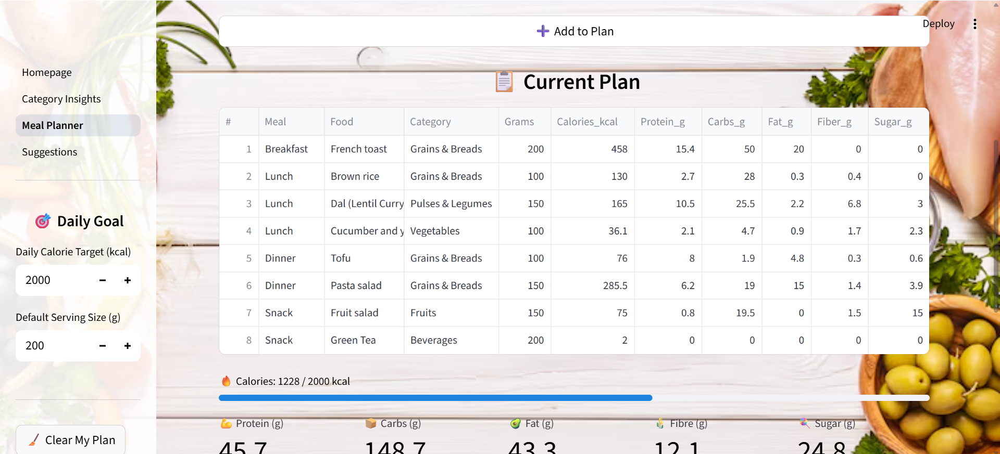
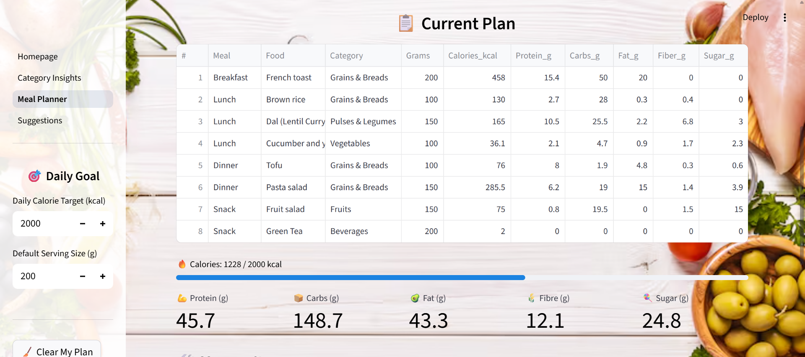
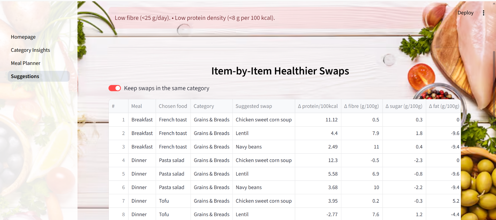
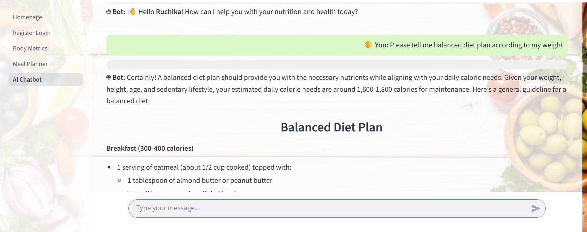
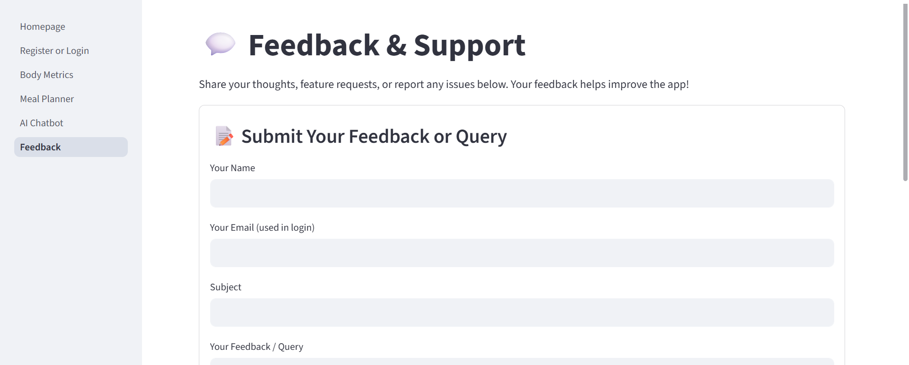

<h1 align="center">🍽️ Exploring Nutrition with Data Science</h1>

---

## 📌 Links

- **USDA FoodData Central (Original Source)**  
  - [FoodData Central Website](https://fdc.nal.usda.gov/)  
  - [Download Data Files](https://fdc.nal.usda.gov/download-datasets.html)  

- **Datasets Used in This App**  
  The large USDA datasets (~200 MB) are hosted externally on **Google Drive** and are downloaded automatically when the notebook or Streamlit app is first launched.  

  - `food.csv` — Foundation + SR Legacy Foods  
  - `food_nutrient.csv` — Nutrient values linked by `fdc_id`  
  - `food_category.csv` — Food category descriptions  
  - `nutrient.csv` — Nutrient definitions and units  

  **Google Drive Archive:** [Download ZIP (Drive)](https://drive.google.com/file/d/YOUR_ZIP_FILE_ID/view?usp=sharing)  
  *(The code automatically extracts this ZIP and loads all four CSVs.)*

- **Presentation Slides** — [Open](https://docs.google.com/presentation/d/18Fi1D3TfFLYg-46NBRKBAIH7EhgcnCN4kzrJiamnipE/edit?usp=sharing)  
- **Streamlit App** — [Open](https://exploringnutritionwithdatascience.streamlit.app/)  

---

<p align="center">
  
</p>

<h1 align="center">🥗 Personalized Nutrition Dashboard</h1>

<p align="center">
  <a href="https://www.python.org/"></a>
  <a href="https://streamlit.io/"></a>
  <a href="https://altair-viz.github.io/"></a>
  
</p>

---

## 📖 Overview
The **Smart Diet & Nutrition App** is an interactive tool that makes **healthy eating personalized**.  
From exploring USDA food data to building meal plans, tracking body metrics, chatting with an AI coach, and collecting user feedback — the app combines **data science + nutrition + interactivity** in one place.  

All **user accounts** and **feedback messages** are securely stored in a **Neon Cloud PostgreSQL** database, ensuring real-time data persistence across sessions.  

<p align="center"><i>Explore → Track → Plan → Improve</i></p>

---

## ✨ Features
- 🔑 Secure **User Registration & Login** — managed via Neon Cloud PostgreSQL  
- 💬 Built-in **Feedback & Support** page — feedback stored securely in the Neon database  
- 📊 Explore **USDA nutrient data** (foundation + legacy)  
- 🧍 Personalized **Body Metrics (BMR/TDEE)**  
- 🥗 **Meal Planner & Swaps** with AI suggestions  
- 🤖 **AI Chatbot** for nutrition & lifestyle guidance  

---

## 🗣️ Feedback System
The app includes a **Feedback & Support** page where users can share comments, questions, or feature requests.  

- Feedback is securely stored in the **Neon PostgreSQL Cloud Database**.  
- Uses `.env` for local development and `st.secrets` on **Streamlit Cloud** for production.  
- Admins can view all feedback directly from a protected admin page.  
- Demonstrates backend data persistence and secure database integration.

---

## 📄 Pages

1. **Homepage Dashboard** → Explore foods by nutrient density (Top Protein, Fibre, Sugar, Fat)  
2. **Register/Login** → Create account or login securely with Neon DB backend  
3. **Body Metrics** → Calculate BMR, TDEE and recommended macros  
4. **Meal Planner & Swaps** → Build daily meals & swap for healthier alternatives  
5. **AI Chatbot** → Conversational nutrition assistant, personalized after login  
6. **Feedback & Support** → Submit feedback or queries stored securely in the Neon database  

---

## 📸 Screenshots

| Food Dashboard | Register/Login |
|---|---|
|  |  |

| Body Metrics | Meal Planner |
|---|---|
|  |  |

| AI Chatbot | Feedback Form |
|---|---|
|  |  |

---

## ⚡ Quickstart

```bash
# 1) Clone the repository
git clone https://github.com/YOUR_USERNAME/smart-nutrition-app.git
cd smart-nutrition-app

# 2) Create and activate a virtual environment
python -m venv .venv && source .venv/bin/activate   # Windows: .venv\Scripts\activate

# 3) Install dependencies
pip install -r requirements.txt

# 4) Environment setup (⚙️ Important)
This app connects to **Neon Cloud PostgreSQL**, where all user accounts and feedback data are stored.

Create a .env file in your project root with your Neon database credentials:

NEON_HOST=your-neon-hostname
NEON_DBNAME=main
NEON_USER=your-username
NEON_PASSWORD=your-password
NEON_SSLMODE=require

⚠️ Make sure `.env` is listed in `.gitignore` to keep it private.

# 5) Run the Streamlit app
streamlit run Homepage.py

# 6) Data auto-load
On first run, the script automatically downloads and unzips the USDA dataset from Google Drive
(`usda_data.zip`) into a local `data/` folder.  
Subsequent runs reuse the extracted files.
