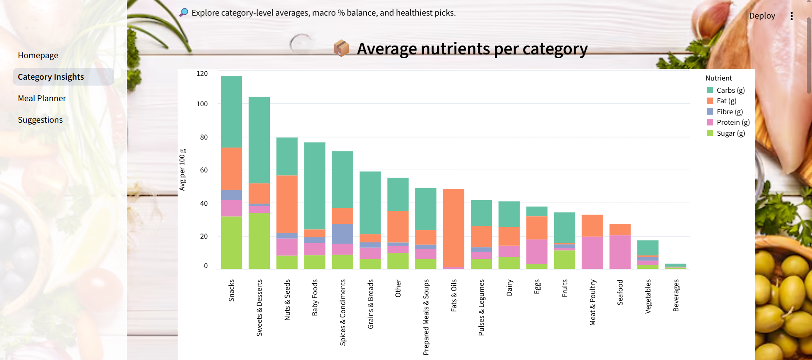
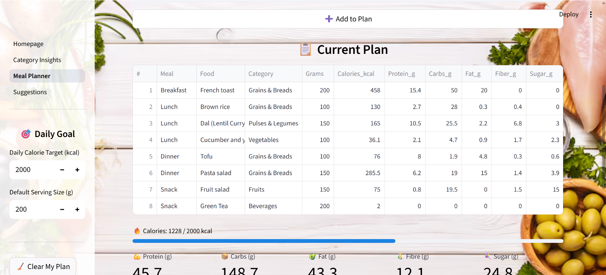
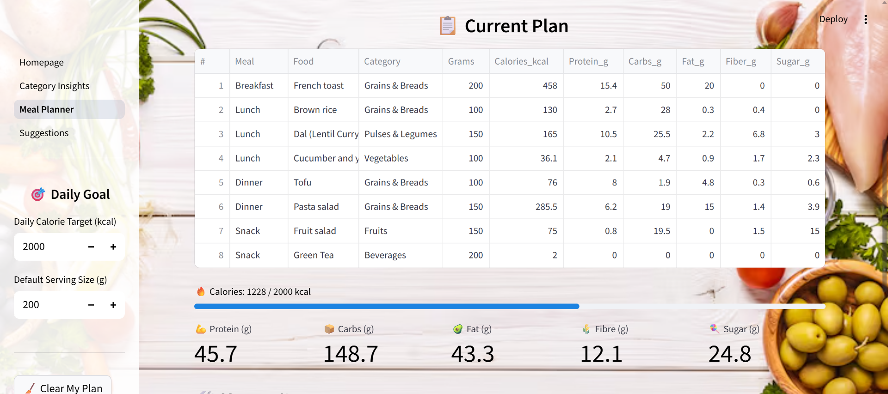
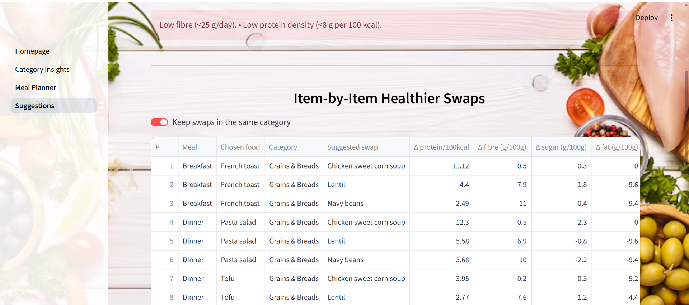
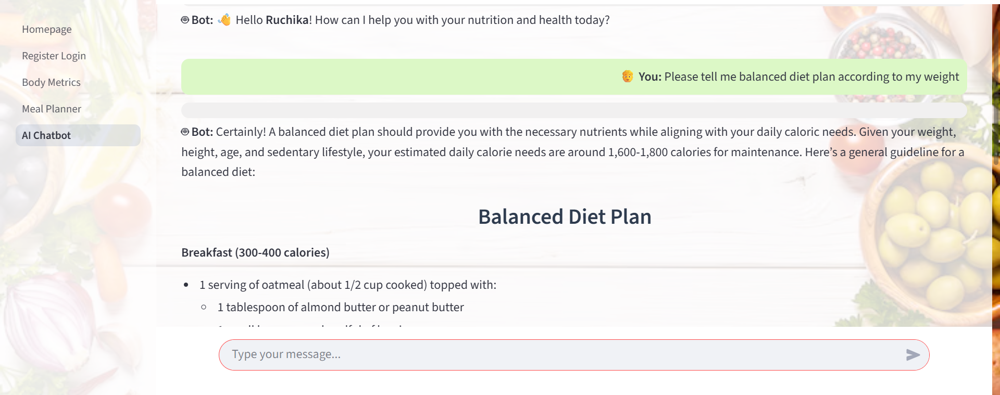
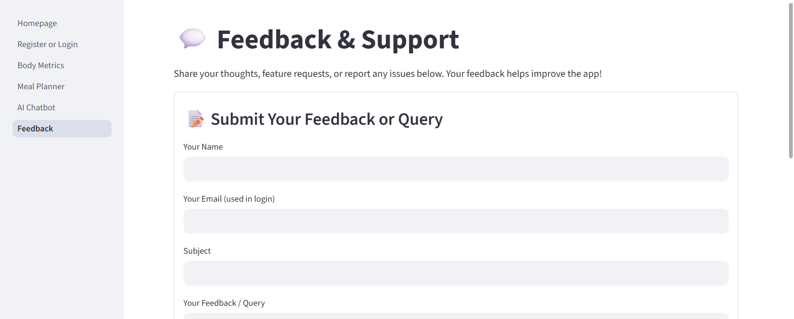

<h1 align="center">🍽️ Exploring Nutrition with Data Science</h1>

<p align="center">
  <b>A full-stack data application combining USDA nutrition data, AI, and cloud database integration.</b>
</p>

<p align="center">
  🚀 <a href="https://exploringnutritionwithdatascience.streamlit.app/"><b>Live App</b></a> |
  📊 <a href="https://docs.google.com/presentation/d/18Fi1D3TfFLYg-46NBRKBAIH7EhgcnCN4kzrJiamnipE/edit?usp=sharing"><b>Presentation Slides</b></a>
</p>

---

<p align="center">
  
</p>

<h1 align="center">🥗 Personalized Nutrition Dashboard</h1>

<p align="center">
  <a href="https://www.python.org/"></a>
  <a href="https://streamlit.io/"></a>
  <a href="https://altair-viz.github.io/"></a>
  <a href="https://www.postgresql.org/"></a>
  
</p>

---

## 📖 Overview

The **Smart Diet & Nutrition App** is an interactive full-stack data science project that makes healthy eating personalized and data-driven.

It integrates:

- 📊 Real USDA nutrition data  
- 🧠 Automated end-to-end data cleaning pipeline  
- 🔐 Secure authentication using Neon PostgreSQL  
- 🤖 AI-powered nutrition assistant  
- 🥗 Intelligent meal planning & healthy swaps  

All user accounts and feedback are securely stored in a Neon Cloud PostgreSQL database, enabling real-time persistence.

<p align="center"><b>Explore → Track → Plan → Improve</b></p>

---


## 📂 Data Pipeline

This project uses official USDA FoodData Central (Foundation + SR Legacy) datasets.

### 📦 Raw Dataset Source

The USDA raw dataset is hosted externally as a ZIP file:

https://drive.google.com/file/d/1tR6mmw-gbH7cZlHig497wC9yXNyg-kEv/view?usp=sharing

You do **not** need to manually extract files.

The Streamlit app reads directly from this cleaned file.

---

## ✨ Features

- 🔑 Secure User Registration & Login  
- 📊 Interactive USDA Nutrient Dashboard  
- 🧍 Personalized Body Metrics (BMR / TDEE)  
- 🥗 Smart Meal Planner & Healthy Swaps  
- 🤖 AI Nutrition Chatbot  
- 💬 Feedback system stored in Neon PostgreSQL  

---

## 🗣️ Feedback System

The app includes a **Feedback & Support** page:

- Feedback stored securely in **Neon PostgreSQL Cloud**
- Uses `.env` locally and `st.secrets` in production
- Demonstrates backend persistence & secure DB integration

---

## 📄 App Pages

1. **Homepage Dashboard** → Explore foods by nutrient density  
2. **Register/Login** → Secure authentication via Neon DB  
3. **Body Metrics** → Calculate BMR, TDEE & macro targets  
4. **Meal Planner & Swaps** → Build daily meal plans  
5. **AI Chatbot** → Conversational nutrition assistant  
6. **Feedback & Support** → Submit feedback securely  

---

## 📸 Screenshots

| Food Dashboard | Register/Login |
|---|---|
|  |  |

| Body Metrics | Meal Planner |
|---|---|
|  |  |
| AI Chatbot | Feedback Form |
|---|---|
|  |  |

---

## ⚡ Quickstart

```bash
# 1) Clone the repository
git clone https://github.com/YOUR_USERNAME/exploring-nutrition-with-data-science.git
cd exploring-nutrition-with-data-science

# 2) Create and activate a virtual environment
python -m venv .venv
# Windows:
.venv\Scripts\activate
# macOS/Linux:
source .venv/bin/activate

# 3) Install dependencies
pip install -r requirements.txt

# 4) Environment setup (Important ⚙️)

Create a .env file in your project root:

DATABASE_URL=your_neon_database_connection_string
OPENAI_API_KEY=your_openai_api_key

⚠️ Make sure `.env` is listed in `.gitignore`.

# 5) Run the Streamlit app
streamlit run Homepage.py
```

---

