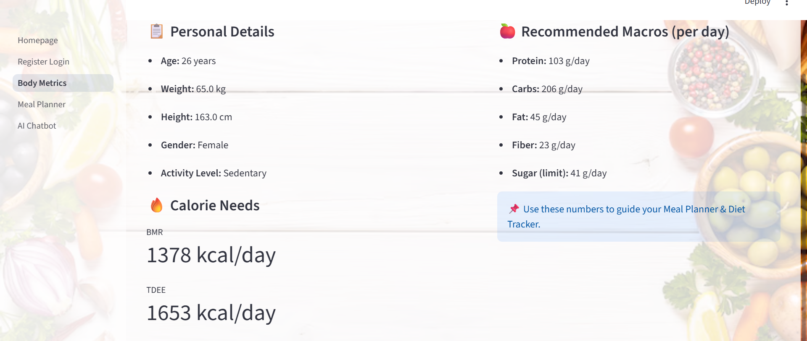

<h1 align="center">🍽️ Exploring Nutrition with Data Science</h1>

---

## 📌 Links

- **USDA FoodData Central (Original Source)**  
  - [FoodData Central Website](https://fdc.nal.usda.gov/)  
  - [Download Data Files](https://fdc.nal.usda.gov/download-datasets.html)  

- **Datasets Used in This App**  
  - `food.csv` — Foundation + SR Legacy Foods   
  - `food_nutrient.csv` — Nutrient values linked by `fdc_id`  
  - `food_category.csv` — Food category descriptions  

- **Presentation Slides** — [Open](https://docs.google.com/presentation/d/18Fi1D3TfFLYg-46NBRKBAIH7EhgcnCN4kzrJiamnipE/edit?usp=sharing)  
- **Streamlit App** — [Open](https://exploring-nutrition-with-data-science.streamlit.app/)  

---

<p align="center">
  
</p>

<h1 align="center">🥗 Personalized Nutrition Dashboard</h1>

<p align="center">
  <a href="https://www.python.org/"></a>
  <a href="https://streamlit.io/"></a>
  <a href="https://altair-viz.github.io/"></a>
  
</p>

---

## 📖 Overview
The **Smart Diet & Nutrition App** is an interactive tool that makes **healthy eating personalized**.  
From exploring USDA food data to building meal plans, tracking body metrics, and chatting with an AI coach — the app combines **data science + nutrition + interactivity** in one place.  

<p align="center"><i>Explore → Track → Plan → Improve</i></p>

---

## ✨ Features
- 📊 Explore **USDA nutrient data** (foundation, legacy)  
- 🔑 Secure **user login & registration**  
- 🧍 Personalized **Body Metrics (BMR/TDEE)**  
- 🥗 **Meal Planner & Swaps** with AI suggestions  
- 🤖 **AI Chatbot** (nutrition + lifestyle Q&A)  

---

## 📄 Pages

1. **Homepage Dashboard** → Explore foods by nutrient density (Top Protein, Fibre, Sugar, Fat)  
2. **Register/Login** → Create account or login securely with Neon DB backend  
3. **Body Metrics** → Calculate BMR, TDEE and recommended macros  
4. **Meal Planner & Swaps** → Build daily meals & swap for healthier alternatives  
5. **AI Chatbot** → Conversational nutrition assistant, personalized after login  

---

## 📸 Screenshots

| Food Dashboard | Register/Login |
|---|---|
|  |  |

| Body Metrics | Meal Planner |
|---|---|
|  |  |

| AI Chatbot |
|---|
|  |

---

## ⚡ Quickstart

```bash
# 1) Clone
git clone https://github.com/YOUR_USERNAME/smart-nutrition-app.git
cd smart-nutrition-app

# 2) Install deps
python -m venv .venv && source .venv/bin/activate   # Windows: .venv\Scripts\activate
pip install -r requirements.txt

# 3) Run app
streamlit run Homepage.py
